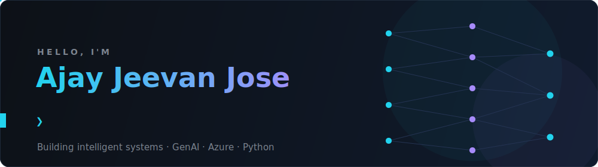

  <picture>
    <source media="(prefers-color-scheme: dark)" srcset="assets/hero-dark.svg">
    <source media="(prefers-color-scheme: light)" srcset="assets/hero-light.svg">
    
  </picture>

  
  &nbsp;
  
  &nbsp;
  

## 🧠 What I Do

<table>
  <tr>
    <td width="50%" valign="top">
      <h3 align="center">🤖 AI Applications &amp; Chatbots</h3>
      
AI-powered products and conversational systems built with <b>OpenAI</b>, <b>LangChain</b> &amp; <b>CrewAI</b>

    </td>
    <td width="50%" valign="top">
      <h3 align="center">📄 Document Intelligence</h3>
      
Processing &amp; extraction pipelines that turn unstructured documents into structured, usable data

    </td>
  </tr>
  <tr>
    <td width="50%" valign="top">
      <h3 align="center">🧪 LLM Testing &amp; Agents</h3>
      
Evaluation harnesses and multi-agent frameworks for reliable, production-grade LLM systems

    </td>
    <td width="50%" valign="top">
      <h3 align="center">☁️ ML Pipelines on Azure</h3>
      
End-to-end pipelines with <b>Azure ML</b>, <b>Data Factory</b> &amp; <b>Synapse</b> — from ingestion to deployment

    </td>
  </tr>
</table>

## 🛠️ Tech Stack

  
    
  
  
  
  
  
  

## 📊 GitHub Analytics

  
  

<!-- HIDDEN: contribution snake + recent activity. These need the snake.yml and
     update-activity.yml workflows, and GitHub Actions is currently blocked on this
     account by a billing lock. To re-enable after fixing billing: restore this section
     from commit 8b501ba (README.md), then run both workflows from the Actions tab.

  <picture>
    <source media="(prefers-color-scheme: dark)" srcset="https://raw.githubusercontent.com/jeev-jo/jeev-jo/output/github-snake-dark.svg">
    <source media="(prefers-color-scheme: light)" srcset="https://raw.githubusercontent.com/jeev-jo/jeev-jo/output/github-snake.svg">
    
  </picture>

## ⚡ Recent Activity

START_SECTION:activity
END_SECTION:activity
-->

## 🌱 Currently Exploring

- Advanced LLM architectures &amp; multi-agent systems
- Scalable AI pipelines &amp; production deployments

  <h3>🤝 Open to collaborating on AI/ML, GenAI &amp; backend projects</h3>
  

    <a href="mailto:jeevsspace@gmail.com"><b>📫 jeevsspace@gmail.com</b></a>
  

